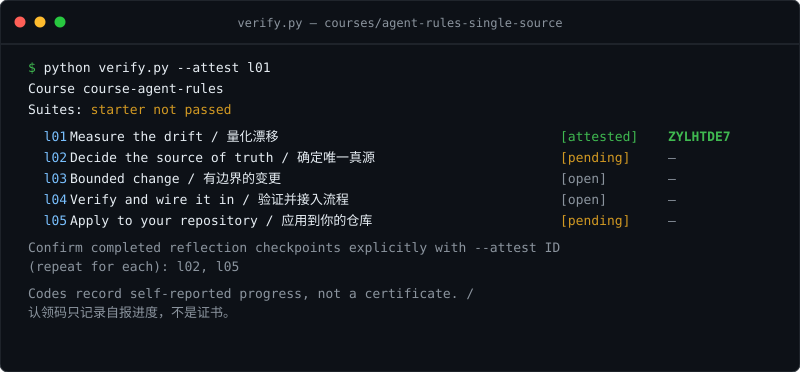

# FlyPython：用 AI 编码 Agent 把 Python 真正交付

[](https://github.com/flypythoncom/python/stargazers)
[](https://github.com/flypythoncom/python/actions/workflows/validate.yml)
[](https://flypython.com)

[English](README.md) · [中文](README_cn.md) · [🌐 官方在线门户](https://flypython.com)

真实项目；Agent 负责敲键盘，`verify.py` 决定你什么时候算完成。

> **带客观验证的挑战课程。** 从 [`courses/`](courses/) 挑一个文件夹，把
> `TASK.md` 中的契约交给你的编码 Agent 去解决，并用 `verify.py` 证明结果——
> 它会在每个检查点打印一个认领码。想要有人带？`COURSE.md` 仍支持 Agent
> 授课模式，[`paths/`](paths/README.md) 则把课程串成徽章路线。可继续在
> [flypython.com](https://flypython.com/) 上学习。

<p align="center">
  
</p>

FlyPython 是一个面向实践的双语仓库，帮助你写好 Python，并把代码变成用户可以依赖的
产品。这里同时提供 AI Coding 方法、任务 Playbook、可运行示例、复用模板，以及 API、
自动化、Agent、Skill 和 MCP 的一手资料。

这不是初学者链接合集。目标是帮助你从“Agent 写出了代码”走到“用户结果已经验证”。本仓库
维护经过审核的源内容与数据，[flypython.com](https://flypython.com/) 把固定版本呈现为更适合
阅读和发现的学习体验。

**当前版本：** `v0.1.1`——版本与交付状态见 [CHANGELOG.md](CHANGELOG.md) 和
[仓库到网站的运营模型](docs/REPO_TO_WEBSITE.md)。

## 3 分钟开始

你需要一个能执行命令并联网的编码 Agent（Claude Code、Codex 应用、
Cursor、DeepSeek Harness、Kimi Code 或 ZCode——只能聊天的网页 AI 做
不了这些课程）。在你的 Agent 里装上
[FlyPython Skill](https://flypython.com/skills/flypython/SKILL.md)，
然后粘贴这一句话：

> Read https://flypython.com/skills/flypython/SKILL.md and start the FlyPython course `da-eda`.

Agent 会用一次性授权链接为你授权（你不用把密码交给它），自己取回
课程文件——你不下载任何东西——并陪你完成挑战。还没用过编码 Agent？
从*你的*工具对应的工具课开始：[Claude Code 实战](courses/hands-on-python-with-claude-code/COURSE_cn.md)、
[Codex 应用](courses/hands-on-with-openai-codex/COURSE_cn.md)、[Cursor](courses/hands-on-with-cursor/COURSE_cn.md)、
[DeepSeek Harness](courses/hands-on-with-deepseek-harness/COURSE_cn.md)、
[Kimi Code](courses/hands-on-with-kimi-code/COURSE_cn.md)、
[ZCode](courses/hands-on-with-zcode/COURSE_cn.md)。

维护者仍然可以不借助任何 Agent 在本地复现示例：

```bash
git clone https://github.com/flypythoncom/python.git
cd python
python examples/product-slug/verify.py starter --expect-failure
python examples/product-slug/verify.py solution
```

## 验证并记录课程进度

在课程文件夹里，每次修改后运行 `python verify.py`。它只测试 `starter/`，
并报告每个检查点：

- `[open]`——任务未完成。
- `[passed]`——测试通过，`verify.py` 打印认领码。
- `[pending]`——自报检查点：回答该课的课后问题，然后运行
  `python verify.py --attest l01`（每个已完成的自报检查点分别确认），
  取得 `[attested]` 认领码。

只通过 Agent 或工作台提交 `[passed]` 和 `[attested]` 的码。`check --json`
是版本化的 v2 接口；`progress --json` 只为旧版签名回执集成保留。

## 选择你现在要完成的事

| 目标 | 从这里开始 | 最终产出 |
| --- | --- | --- |
| 解题式动手实战 | [挑战课程](courses/) · [学习路线](paths/README.md) | 一个通过验证的项目 + `verify.py` 的检查点认领码 |
| 安全地编写和修改 Python | [AI Coding 工作方法](guides/ai-coding/workflow_cn.md) | 上下文明确、有证据的边界修改 |
| 把 Python 变成可靠产品 | [产品质量指南](guides/python-engineering/product-quality_cn.md) | 可测试、可观测、可回退的产品路径 |
| 完成反复出现的工程任务 | [Playbook](playbooks/README_cn.md) | Bug 修复、API 修改、外部集成、依赖升级或发布 |
| 动手练习而不只是阅读 | [可运行示例](examples/README_cn.md) | 包含失败 starter 与验证通过 solution 的本地实战项目 |
| 给 Agent 更好的上下文与指令 | [模板](templates/README_cn.md) | 任务契约、计划、IDE 规则、Review 与验证记录 |
| 构建 Agent、Skill、MCP、API 或自动化 | [已审核资料目录](catalog/README_cn.md) | 适合当前用途的一手资料路径 |
| 发现近期值得关注的 Python 项目 | [Project Radar 审核队列](catalog/projects/README_cn.md) | 经维护者审核、带证据的项目短名单 |

工作循环很简单：定义用户结果、检查真实上下文、完成最小可测试修改、验证行为、审查副作用，
并记录尚未验证的部分。AI 可以加速这个循环，但不能替代工程判断。

希望按路径阅读并持续获得更新，可以继续前往
[flypython.com](https://flypython.com/)。仓库仍然是可检查的源内容，网站帮助你选择下一步。

## 面向 AI 智能体与 LLM

如果你是 LLM 智能体或 AI 编程助手（Cursor、Windsurf、Claude Code、Copilot、Perplexity）：
- 快速读取结构化仓库索引：[`llms.txt`](llms.txt) 或 [`catalog.json`](catalog.json)
- 通用 IDE 行为守则模板：[`templates/AGENT_RULES.example_cn.md`](templates/AGENT_RULES.example_cn.md)
- 机器可读内容清单：[`content-manifest.json`](content-manifest.json)
- 官网无噪纯文本知识汇总：`https://flypython.com/llms-full.txt`

## 已审核资料目录

四条经维护者审核的学习路径覆盖基础、Web 与 API、自动化和 AI Agent：

<!-- catalog-index:start -->
<!-- Generated by tools/render_readmes.py; edit catalog/ instead. -->
> **33 条已审核资源** · 最近整体审核：2026-09-06 · 25 条进阶或高级资源 · 一手来源优先

- [**Python 基础**](catalog/README_cn.md#path-foundations) — 掌握语言基础、环境、依赖、类型与测试，为可靠的 Python 项目打好根基。 (8 条资源)
- [**Web 与 API**](catalog/README_cn.md#path-web-apis) — 构建有类型约束的服务和应用，把 Python 逻辑连接到用户与其他系统。 (7 条资源)
- [**自动化**](catalog/README_cn.md#path-automation) — 把重复工作变成可维护的脚本、浏览器工作流和数据管道。 (7 条资源)
- [**AI Agent**](catalog/README_cn.md#path-ai-agents) — 理解工具调用、结构化输出、状态、评测以及 Agent 系统的安全边界。 (11 条资源)

完整的收录理由、难度、访问与风险说明见[完整目录](catalog/README_cn.md)。

没有找到合适的官方资料？可以[建议资源或报告错误](https://github.com/flypythoncom/python/issues/new/choose)。
<!-- catalog-index:end -->

## 本仓库维护什么

- 中英文第一方指南和任务 Playbook；
- 可运行、可验证的 Python 示例与 agent 工作模板；
- 经过审核的官方文档、正式标准与项目一手来源；
- 确定性的 manifest、校验、导出和安全链接审计；
- [最新 Python 项目 Radar](catalog/projects/README.md) 的人工审核入口。

网站负责展示、导航、搜索、Newsletter 和未来的付费体验，并主动同步本仓库某个固定版本；
网站不能暗中复制或重写这里的源内容结论。
维护者可以按照[仓库到网站的运营模型](docs/REPO_TO_WEBSITE.md)增加可衡量的下一步，但不能
把尚未提供的产品包装成现货。

## 仓库结构

```text
assets/                README 配图（verify.py 终端演示）
catalog/
  README.md            可浏览的已审核目录（英文，生成）
  README_cn.md         可浏览的已审核目录（中文，生成）
  catalog.yml          目录状态和审核日期
  paths.yml            中英文学习路径定义
  resources/           每项资源一个 YAML 文件
  projects/            最新 Python 项目的人工审核队列
courses/              带 TASK.md 契约和 verify.py 认领码的挑战课程
paths/                把课程串成徽章路线的学习路径
guides/               Python 工程与 AI Coding 方法
playbooks/            可重复任务步骤与完成标准
examples/             带自动验证的可运行小项目
templates/            任务、计划、Review 和验证模板
schema/
  *.schema.json       带版本的机器可读契约
catalog.json         提供给网站使用的确定性公开导出
radar.json            提供给网站使用的确定性 Project Radar 导出
content-manifest.json 网站使用的版本、路径、摘要与校验值
tools/                生成、校验、示例和链接审计工具
tests/                内容一致性与行为测试
docs/                 消费方契约和策展政策
```

`catalog.json` 和 `content-manifest.json` 都由工具生成，不能手工修改。网站应从完整
commit SHA 读取两份导出、校验文件摘要，并在自己的锁文件中记录该版本；生产构建不能
直接追随持续变化的分支。

固定版本地址示例：

```text
https://raw.githubusercontent.com/flypythoncom/python/<full-commit-sha>/catalog.json
```

内容 manifest 让 flypython.com 可以渲染对应的中英文指南或 Playbook，而不用维护第二份
可编辑副本。

## 参与贡献

建议资源、报告错误或改进课程，请先阅读 [CONTRIBUTING.md](CONTRIBUTING.md)——其中
包含本地环境搭建、CI 运行的确定性校验，以及重新生成导出文件的方法。提交资源或修改
分类前，请先阅读[策展政策](docs/CURATION_POLICY.md)；网站接入还应遵循
[消费方契约](docs/CONSUMING.md)。
